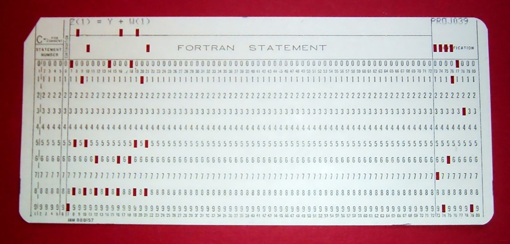

# 计算机基础知识

## 你为什么学计算机？

我们在做每一件事情之前，都是有动机的。你学习计算机，学习编程的动机是什么？

老实说，我一开始想做编程，是因为我想过懒人的生活，想着一天起床，有机器人叫我醒来，帮我做好早餐，各种高科技机器人的智能生活，那还是我读小学的时候幻想出来的。后来，钢铁侠电影出现了，将我的梦想以电影的形式实现出来，我真的太想有那种生活了，后来毕业了。慢慢了解到，我要实现的那种生活方式，是一个叫做智能家居的东西。可是智能家居是一整套软硬件结合的东西，我当时很迷茫，什么都去学，可是到头来，找工作面试处处碰壁。我知道，我心思太多，10个桶，每个桶都只有5%的水。有人也善意的告诉我，要专注。可是我一直没有学会如何专注。或许写书，能让我的思维稍微专注点吧。

刚刚想到一件事情，专注和发散之间的关系。如果太过专注就很容易自己陷入思维的死胡同，太过发散，就干不好每一件事情。要学会适度平衡才可以了。

好了，总之我学编程，是为了过懒人生活，我很懒，也是我学习的动机！

## 什么是计算机语言？

计算机也是有语言的。首先我们知道，最底层的计算机，也就是电路板，它没有我们想象的那么聪明，它只认识高电平，低电平（也就是电灯开和关的意思）。刚开始计算机发明出来的时候是用纸带进行编程的

“古代”的程序就是一条条纸带，在上面打孔，然后再交给计算机去处理，当时有一个古老的设备叫做“打孔卡（Punched Card）”。所以当时编程是极其枯燥和乏味，而且很容易出错。一旦一个位置打错了，整条纸带都不能用重新打过。感觉特别考验程序员的想象力，要把程序想好再去打（貌似那时候还没有不是叫程序员）。人们在特定的位置上打洞或者不打洞，来代表“0”或者“1”。所以计算机底层都是一串串0和1在执行。

下面是打孔卡的照片⬇

看到上面有FORTRAN字样，不知道是不是和FORTRAN语言有关系  🤔。

言归正传，计算机语言到最后翻译成0或者1（这些东西就是机器码），然后丢给cpu执行。我们现在每天使用的高级语言是对人类友好的，计算机压根不懂这些。所以什么是计算机语言？就是给人看得懂，计算机看不懂，然后能够执行的时候翻译成一串串0或者1给计算机执行方式。这个过程可以这样表示

> 什么是汇编？
>
> 严格的说是 将 汇编语言源程序 转换成 机器语言程序 的过程。
>
> 那么是谁将计算机语言（低级语言）翻译成机器码呢？
>
> 那就是编译器啦

很古老的一个语言，C语言就是一种高级语言，C语言通过gcc编译器就能编译汇编出机器码执行。

但是我们这里的主角不是C语言，是java，所以省略。。。。。

而我为什么提C语言呢?且看下章[java基础](commonsense.md)。

